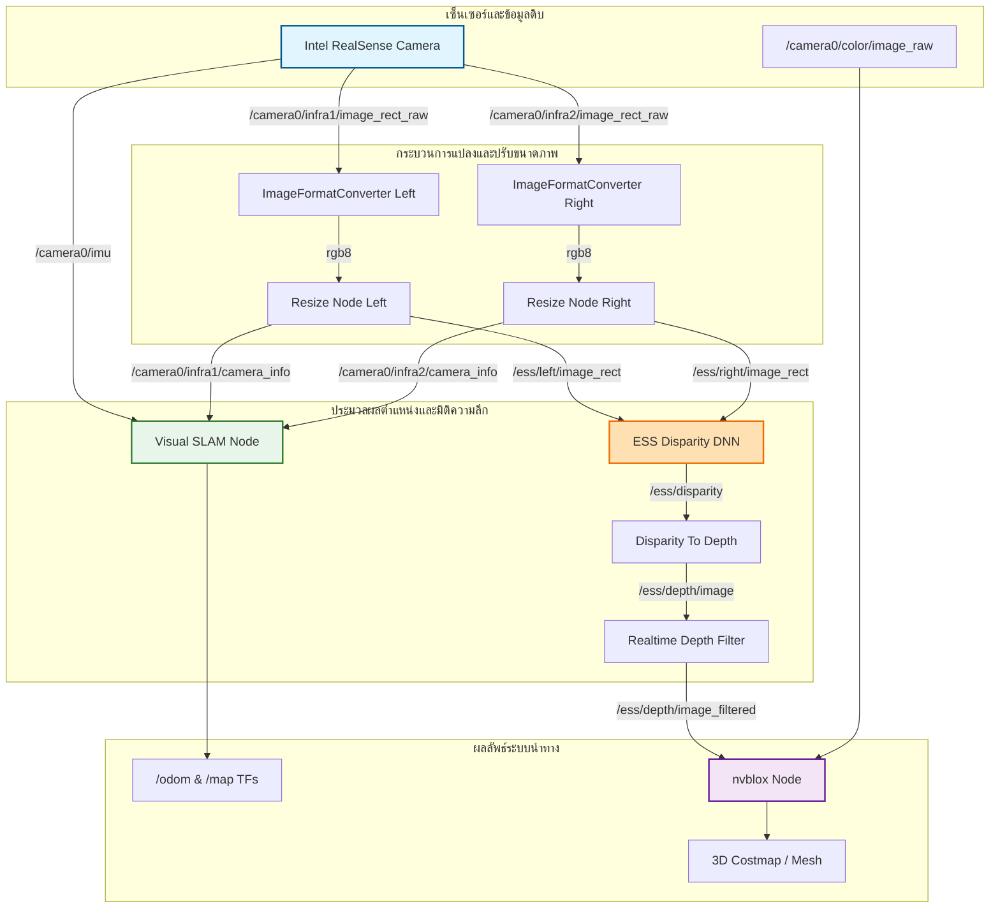

# Autonomous Robot Localization and Navigation System (Localize-and-navigate)

โปรเจกต์นี้เป็นส่วนหนึ่งของระบบนำทางและระบุตำแหน่งอัตโนมัติสำหรับหุ่นยนต์ (Autonomous Robot) โดยประยุกต์ใช้งานเทคโนโลยี **NVIDIA Isaac ROS** ร่วมกับกล้อง **Intel RealSense** เพื่อประมวลผลการคำนวณประสิทธิภาพสูงบนฮาร์ดแวร์ตระกูล NVIDIA Jetson หรือพีซีที่มี GPU สถาปัตยกรรมระดับสูง ระบบนี้เน้นไปที่การทำ Visual SLAM, การคำนวณความลึกด้วย AI (ESS Stereo Disparity) และการทำแผนที่ 3 มิติแบบ Real-time (nvblox)

---

## 🚀 ภาพรวมของระบบ (System Architecture)

ระบบทำงานบนเฟรมเวิร์ก **ROS 2** โดยรวมทุกโหนดประมวลผลไว้ในตู้คอนเทนเนอร์เดียวกันแบบ Multi-Threaded (`component_container_mt`) เพื่อเปิดใช้งานระบบสื่อสารภายในกระบวนการเดียวกัน (**Intra-process Communications**) ช่วยลด Overhead ในการส่งข้อมูลภาพที่มีความละเอียดสูงได้อย่างมีประสิทธิภาพ

### ส่วนประกอบหลักของระบบ (Core Components)
1. **Sensor Input (`realsense2_camera`)**: ดึงข้อมูลภาพจากกล้องอินฟราเรดซ้าย-ขวา (Infra Stereo), ภาพสี (RGB) และข้อมูลการเคลื่อนไหว (IMU) จากกล้อง Intel RealSense
2. **Image Pre-processing (`isaac_ros_image_proc`)**:
   * แปลงฟอร์แมตภาพขาวดำ (Mono Infra) ให้เป็น `rgb8` เพื่อให้รองรับกับโมเดลโครงข่ายประสาทเทียม
   * ย่อขนาดภาพให้เหลือ $960 \times 576$ พิกเซล ซึ่งเป็นมิติที่เหมาะสมที่สุดสำหรับโมเดล ESS 
3. **AI Depth Estimation (`isaac_ros_ess`)**: ใช้โมเดล **ESS (Stereo Disparity DNN)** ของ NVIDIA เร่งความเร็วผ่าน TensorRT (`ess.engine`) เพื่อคำนวณความลึก (Disparity) จากภาพสเตอริโอคู่
4. **Depth Filtering (`robot_bringup`)**: กรองสัญญาณรบกวนและเติมเต็มพิกเซลความลึกที่ขาดหายไปผ่านโหนดคัสตอม `RealtimeDepthFilterNode`
5. **Visual SLAM (`isaac_ros_visual_slam`)**: ทำการฟิวชันข้อมูลภาพอินฟราเรดสเตอริโอกับ IMU (Visual-Inertial Odometry) เพื่อระบุตำแหน่งของหุ่นยนต์ ($x, y, z$ และ Orientation) แบบ Real-time พร้อมฟีเจอร์โหลดแผนที่เพื่อทำ Localization ณ ตอนเริ่มต้นทำงาน
6. **3D Mapping (`nvblox_ros`)**: นำภาพความลึก (Depth) และภาพสี (Color) มาสร้างเป็นแผนที่ความละเอียดสูงแบบ 3 มิติ (TSDF Base) สำหรับใช้ในการวางแผนเส้นทางและหลบหลีกสิ่งกีดขวาง

---

## 📂 โครงสร้างการส่งข้อมูล (Data Flow & Remappings)


## 🚀 วิธีการสั่งงาน (Usage & Deployment)

การรันระบบระบุตำแหน่งและนำทางสามารถเลือกใช้ได้ 2 รูปแบบตามลักษณะการประมวลผลของภาพความลึก:

### 1. โหมดประมวลผล Depth แบบดั้งเดิม (Standard Mode)
โหมดนี้จะส่งภาพ Depth ที่แปลงมาจากข้อความกลุ่มของ ESS เข้าสู่โหนดสร้างแผนที่ `nvblox` โดยตรงโดยไม่มีการกรองพิกเซล:
```bash
ros2 launch robot_bringup White_poselocalize.launch.py
